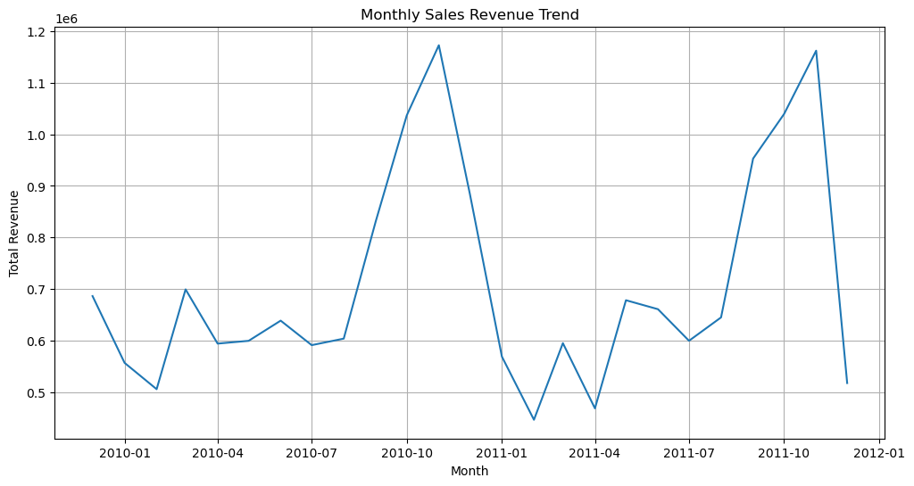
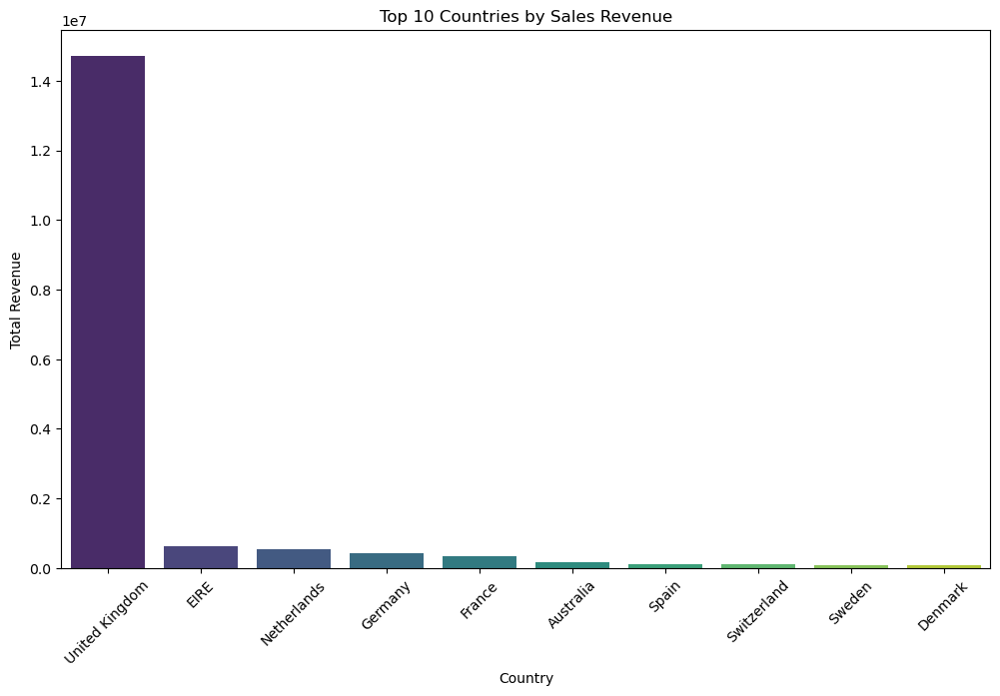
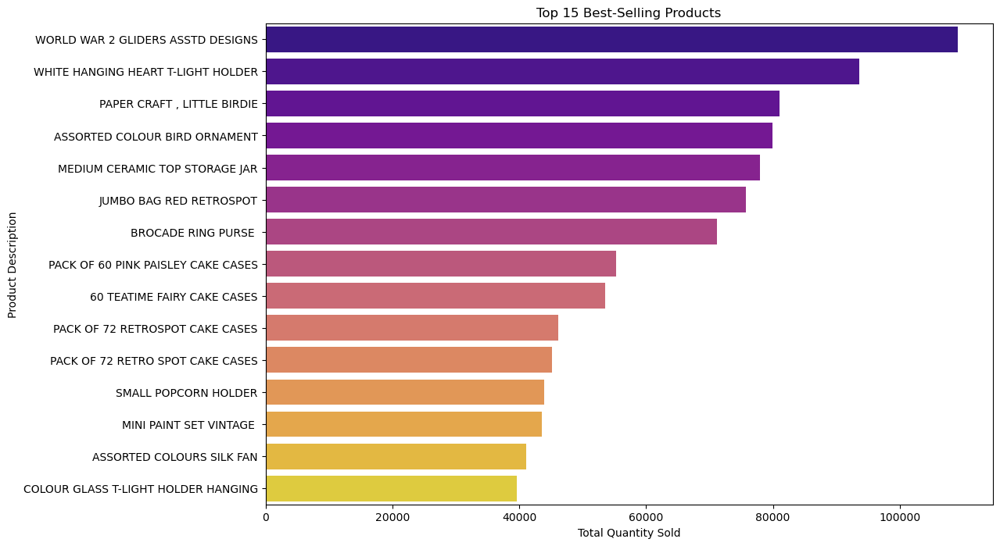
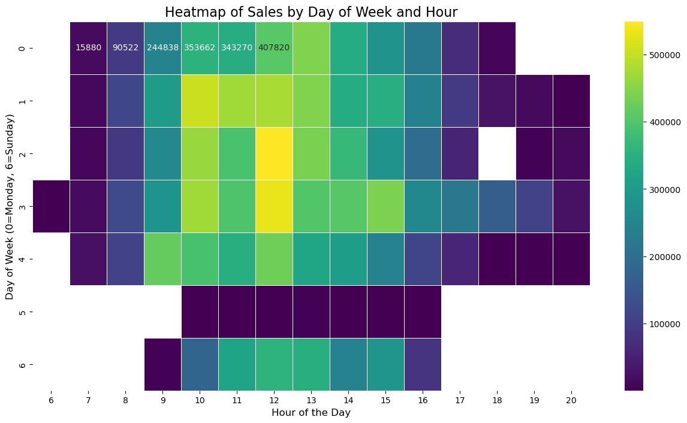

Of course. Here is the `README.md` content with the image placeholders included. You can copy and paste this directly into your `README.md` file.

-----

# Global E-commerce Trends Analysis 📊

## Project Overview

This project conducts a multi-faceted analysis of a global e-commerce dataset to uncover actionable insights into sales performance, customer behavior, and product trends. The goal is to leverage data to inform marketing, sales, and product strategies. The analysis was performed using Python with libraries such as Pandas, Matplotlib, Seaborn, and MLxtend.

-----
## Data Source
The dataset used for this analysis is the "Online Retail II UCI" dataset. Due to its size, it is not included in this repository. You can download it directly from Kaggle at the following link:

**Kaggle**: https://www.kaggle.com/datasets/online-retail-ii-uci

Please download the online_retail.csv file and place it in the main project directory to run the Jupyter Notebook

## Setup & Installation

To run this analysis, you'll need to have Python and Jupyter Notebook installed. You can install the necessary libraries using pip:

```bash
pip install pandas matplotlib seaborn mlxtend
```

-----

## Key Findings & Visualizations

### 1\. Monthly Sales Revenue Trend

The business demonstrates a consistent upward trend in monthly revenue, with a significant and predictable spike in sales during the November-December period, highlighting the impact of holiday shopping.



### 2\. Top 10 Countries by Revenue

While the United Kingdom is the primary market, **Germany** stands out as the most significant market outside of the UK. This represents a major opportunity for focused growth and targeted marketing efforts.



### 3\. Best-Selling Products

The most popular items are often low-cost, high-quantity products. This suggests a price-sensitive customer base or a significant amount of bulk purchasing behavior.



### 4\. Customer Purchasing Patterns

A heatmap of sales activity reveals that weekdays, particularly mid-week around midday (11 AM - 2 PM), are the busiest shopping times. This pattern suggests a customer base primarily composed of B2B clients or professionals shopping during their workday.



-----

## Advanced Analysis

### Customer Segmentation with RFM Analysis

An RFM (Recency, Frequency, Monetary) analysis was performed to segment customers into distinct groups based on their purchasing behavior. This allows for more targeted and effective marketing campaigns. Key segments identified include:

  * **Champion Customers:** High-value, frequent buyers who should be targeted with loyalty programs.
  * **At-Risk Customers:** Customers who have not purchased in a while and need re-engagement campaigns.
  * **Lost Customers:** Inactive customers.

### Market Basket Analysis

A market basket analysis was conducted on the German customer data to identify frequently co-purchased items. The analysis revealed strong associations between certain products (rules with a **lift greater than 1**), providing a data-driven basis for product bundling and cross-promotional strategies.

-----

## Conclusion & Recommendations

This analysis confirms the business is on a strong growth path with clear opportunities for optimization. Based on the data, the following actions are recommended:

1.  **Capitalize on Seasonality:** Launch targeted marketing campaigns and increase ad spend in the months leading up to the November-December peak to maximize holiday sales.
2.  **Focus on the German Market:** Develop a dedicated marketing strategy for Germany, including localized content and promotions, to further penetrate this high-value market.
3.  **Implement a Segmented CRM Strategy:** Create personalized email campaigns based on the RFM segments to improve customer retention and lifetime value.
4.  **Create Data-Driven Product Bundles:** Utilize the insights from the Market Basket Analysis to create product bundles and "frequently bought together" recommendations on the website.